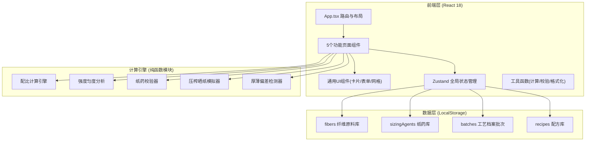
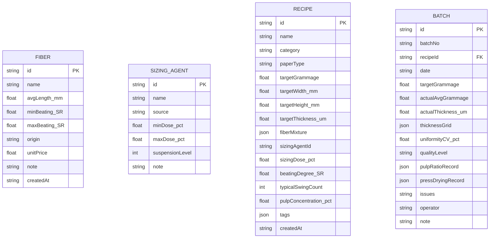

## 1. 架构设计

## 2. 技术描述

- **前端**：React@18 + TypeScript + Vite@5 + TailwindCSS@3 + ReactRouterDOM@6 + Zustand@4 + LucideReact
- **初始化工具**：vite-init（react-ts 模板）
- **后端**：无后端，纯前端单页应用
- **数据持久化**：浏览器 LocalStorage（JSON 序列化），初始化内置示例数据
- **UI 组件库**：不引入重型组件库，使用 Tailwind 原子类 + 轻量自定义组件（符合极简与独特美学原则）

## 3. 路由定义

| 路由 | 页面组件 | 用途 |
|------|----------|------|
| `/` | 重定向 `/materials` | 默认跳转原料录入页 |
| `/materials` | MaterialsPage | 原料录入：纤维与纸药管理 |
| `/ratio` | RatioPage | 纸浆配比：计算、校验、模拟、反推 |
| `/thickness` | ThicknessPage | 抄纸厚薄：网格检测、偏差标红、预警 |
| `/archive` | ArchivePage | 工艺档案：批次查询与详情 |
| `/recipes` | RecipesPage | 配方库：保存、载入、分类管理 |

## 4. 数据模型

### 4.1 实体关系

## 5. 核心计算模块（src/utils 目录）

| 文件 | 导出函数 | 职责 |
|------|----------|------|
| `calculator.ts` | `calcPulpConcentration()` `calcSwingCount()` `reverseRatioFromTarget()` | 配比与反推核心算法 |
| `strength.ts` | `evalTearIndex()` `evalBurstIndex()` `evalUniformity()` | 强度与匀度评分 |
| `sizing.ts` | `checkSizingDose()` `assessSuspension()` `assessRelease()` | 纸药用量校验 |
| `drying.ts` | `simulatePress()` `simulateSunDrying()` | 压榨与晒纸模拟 |
| `thickness.ts` | `detectDeviation()` `markFlocculation()` `assessReleaseRisk()` | 厚薄检测与风险预警 |
| `storage.ts` | `useLocalStore()` 封装 | LocalStorage 读写封装 |
| `mock.ts` | `seedMockData()` | 内置示例数据初始化 |

## 6. 状态管理结构

 Zustand store (src/store/paperStore.ts) 包含：
- `fibers`: Fiber[] — 原料纤维列表
- `sizingAgents`: SizingAgent[] — 纸药列表
- `recipes`: Recipe[] — 配方库
- `batches`: Batch[] — 工艺档案批次
- `currentRatio`: RatioConfig — 当前配比配置
- `currentThicknessGrid`: number[] — 当前厚薄检测网格数据
- 对应 CRUD actions: `addFiber`, `updateRecipe`, `saveBatch`, `loadRecipeToRatio` 等
- 持久化中间件：persist 到 LocalStorage

## 7. 组件拆分策略

| 目录 | 组件 | 用途 |
|------|------|------|
| `src/components/layout/` | `Sidebar.tsx` `TopBar.tsx` `PaperCard.tsx` | 布局外壳与通用卡片 |
| `src/components/ui/` | `Field.tsx` `Button.tsx` `ProgressBar.tsx` `Badge.tsx` `MetricDisplay.tsx` | 原子UI组件 |
| `src/components/materials/` | `FiberForm.tsx` `FiberTable.tsx` `SizingForm.tsx` `SizingTable.tsx` | 原料页子组件 |
| `src/components/ratio/` | `TargetInputs.tsx` `RatioResult.tsx` `IndicatorBars.tsx` `ReversePanel.tsx` | 配比页子组件 |
| `src/components/thickness/` | `CurtainGrid.tsx` `DeviationLegend.tsx` `WarningBar.tsx` | 厚薄页子组件 |
| `src/components/archive/` | `BatchTimeline.tsx` `BatchDetailDrawer.tsx` | 档案页子组件 |
| `src/components/recipes/` | `RecipeGrid.tsx` `RecipeCard.tsx` `RecipeFormModal.tsx` | 配方库子组件 |
